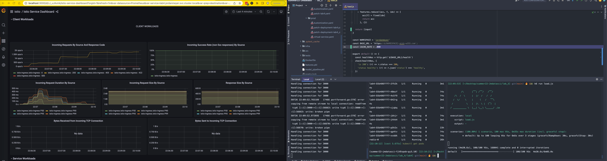

# Readme  
##### W255 Machine Learning Systems Engineering
##### Jordan Meyer - 07/27/22
#### Lab 5

### Load Test Review
For this lab we utilized the implementation as described below and generated in lab 4 along with a load test script utilizing `k6.
I conducted 5 different load tests at varying cache levels to demonstrate the impact of caching in a simulated production environment. 
    
#### Cache Rates used in Tests:
* 0 Cache - no duplicate queries
* 0.5 Cache - approximately half of the queries will be repeated
* 0.75 Cache - approximately 3/4 of the queries will be repeated
* 0.999 Cache - almost all of the queries will be repeated
* 1 Cache - All queries are identical
* 10 Cache - To see if any difference happens
* 0.5 Cache - Retest as there may have been extra pods up at the start
* 0.75 Cache - Retest as there may have been extra pods up at the start

These load tests consisted of 200,000 - 300,000 curl requests spread out over 6 minutes following a steady 1 minute ramp up followed by that load maintained for the next 5 minutes.  Latencies from each of the load tests are displayed in the table below from grafana (server-side).

### Peak Latencies:  

| Cache Rate | P50 Latency | P90 Latency | P95 Latency | P99 Latency |
|------------|-------------|-------------|-------------|-------------|
| 0          | 237         | 448         | 475         | 496         |
| 0.5        | 3.27        | 7.64        | 9.36        | 22          |
| 0.75       | 3.29        | 10.2        | 18.7        | 31.2        |
| 0.999      | 46.9        | 95.3        | 135         | 227         |
| 1.0        | 266         | 483         | 632         | 926         |


### Sustained Latencies:  

| Cache Rate  | P50 Latency | P90 Latency | P95 Latency | P99 Latency |
|-------------|-------------|-------------|-------------|-------------|
| 0           | 3.25        | 6.66        | 8.59        | 13.9        |
| 0.5         | 3.10        | 4.88        | 7.45        | 9.72        |
| 0.75        | 3.09        | 4.96        | 8.47        | 25.5        |
| 0.999       | 2.99        | 4.72        | 4.9         | 8.15        |
| 1.0         | 2.96        | 4.73        | 4.92        | 8.75        |


Cache 0: 


Cache 0.5:


Cache 0.75:


Cache 0.999:



Cache 1:


The most interesting part about this is how the latency ramps up until extra pods come online at which point we see the latency take an incremental step downward and the number of operations per second take an incremental step increase as our `horizontal pod autoscaler` kicks in. 

Typically, these tests show a slight reduction in latency based on the improved cache rates. In some cases where we don't see an improvement (we should) it could be due to some other factors such as higher utilization (we are all testing around the same times), it may be due to the rate at which additional pods kicked up differing from test to test. 
For instance, in this screenshot of the entire period of load testing on my cluster I can see the different behaviors of the request operations being handled on the top-left and a variation of the latency on the bottom left


In this screenshot we can see tests side by side with the ramp ups and the variation on latency not necessarily based on the cache rate. However, we do find with a higher cache rate we seem to perform ever so slightly better. 
One additional caveat, for our first tests of 0.5 and 0.75 I have reconducted as there may have been extra pods online at the time giving an unfair advantage in these cases


Retests:
0.5:


0.75 (and 10): 


I tried to conduct this with cache = 1 expecting to see some behavior with a lower latency however this was not the case:


I am also running a bonus load test with a cache rate of 10. This should perform identically to 1 however I still think we should have seen better performance with full caching.
With cache rate = 10:


I can see a high peak, higher than expected, 266,483, 632 and 926 for P50, 90, 95 and 99 respectively. However as we see the step changes in pods come online to handle more operations the latency drops to a reasonable 

2.96, 4.73, 4.96, 9.95 

Overall we are seeing what we expect, a decreased sustained latency under load based on an increased cache rate.  I would disqualify 0.75 cache P99 results as they are significantly beyond expected values and likely due to increased simultaneous usage with other students.


## 1. Hosting App  
**Requirements -** `Bash, curl, Docker, Python, minikube, kubectl, kustomize, kubeconfig, Azure CLI`

This app is run on Azure Kubernetes Service and uses docker image `lab4:695af0f` that was built and hosted in Azure Cloud Registry at `w255mids.azurecr.io/jordanmeyer/lab4:695af0f`  

To start up the app you first need to authenticate into Azure (`az`, `acr`, `aks`) with the following commands:  
```bash
az login --tenant berkeleydatasciw255.onmicrosoft.com
az account set --subscription=6baae99a-4d64-4071-bfac-c363e71984c3
az aks get-credentials --name w255-aks --resource-group w255 --overwrite-existing
az acr login --name w255mids
kubectl config use-context w255-aks
kubelogin convert-kubeconfig
```

Then to pull the image:

```bash
IMAGE_PREFIX=jordanmeyer
IMAGE_NAME=lab4
ACR_DOMAIN=w255mids.azurecr.io
TAG=695af0f
IMAGE_FQDN="${ACR_DOMAIN}/${IMAGE_PREFIX}/${IMAGE_NAME}:${TAG}"
docker pull ${IMAGE_FQDN}
```

Once you have the image ready you can apply your `kustomization.yaml`s to start the cluster:

```bash
kubectl config set-context --current --namespace=jordanmeyer
kubectl kustomize .k8s/overlays/prod
kubectl apply -k .k8s/overlays/prod
```

At this point, your cluster will begin to startup and run the initialization processes before being ready to receive commands. 
The server can then be queried in the same process as previous iterations with the only difference being a new domain and no required port 
as we are now using an istio ingress gateway to handle directing traffic.

## 2. `/predict` endpoint
a. This endpoint is designed to receive a `POST` request along with data as list of json dictionaries with the schema:  
        
      [
        {
        "MedInc": float,
        "HouseAge": float,
        "AveRooms": float,
        "AveBedrms": float,
        "Population": float,
        "AveOccup": float,
        "Latitude": float,
        "Longitude": float
        },
        {...}
      ]  

  b. This endpoint is a response model which returns predictions for home price estimates in the following format:  
```bash
  [
    {
    "query_key": md5_hash,
    "inputs": {
    ["MedInc": float,
    "HouseAge": float,
    "AveRooms": float,
    "AveBedrms": float,
    "Population": float,
    "AveOccup": float,
    "Latitude": float,
    "Longitude": float]
    },
    "prediction": [float]
    }
  ]  
```  

      
  c. Any extraneous parameter provided is ignored and the model will continue with the necessary params.  i.e. 
  ```bash
      curl -X 'POST' \
      'http://jordanmeyer.mids-w255.com/predict' \
      -H 'accept: application/json' \
      -H 'Content-Type: application/json' \
      -d '[
      {
        "MedInc": 1,
        "HouseAge": 1,
        "AveRooms": 1,
        "AveBedrms": 1,
        "Population": 1,
        "AveOccup": 1,
        "Latitude": 1,
        "Longitude": 1
      }
    ]'
 ```  
Is handled identically to:  

  ```bash
     curl -X 'POST' \
      'http://jordanmeyer.mids-w255.com/predict' \
      -H 'accept: application/json' \
      -H 'Content-Type: application/json' \
      -d '[
      {
        "MedInc": 1,
        "HouseAge": 1,
        "AveRooms": 1,
        "AveBedrms": 1,
        "Population": 1,
        "AveOccup": 1,
        "Latitude": 1,
        "Longitude": 1,
        "Extra_Param": Val
      }
    ]'
 ```  

### Warnings  
Any single validation failure will cause an entire `/predict` call to fail with `422 Unprocessable Entity` i.e. although the first `dict` is valid, the second `dict` will fail validation causing the entire request to get rejected.  

```bash
    curl -X 'POST' \
      'http://jordanmeyer.mids-w255.com/predict' \
      -H 'accept: application/json' \
      -H 'Content-Type: application/json' \
      -d '[
      {
        "MedInc": 1,
        "HouseAge": 1,
        "AveRooms": 1,                    
        "AveBedrms": 1,
        "Population": 1,
        "AveOccup": 1,
        "Latitude": 1,
        "Longitude": 1,
      },
        {
        "MedInc": -1,
        "HouseAge": 1,
        "AveRooms": 1,                    
        "AveBedrms": 1,
        "Population": 1,
        "AveOccup": 1,
        "Latitude": 1,
        "Longitude": 1,
      }
    ]'
    ```  
    
    
## 3. Sample Query

#### Input:  
```bash
curl -X 'POST' 'https://jordanmeyer.mids-w255.com/predict' -L -H 'Content-Type: application/json' -d '[{ "MedInc": 8.3252, "HouseAge": 42, "AveRooms": 6.98, "AveBedrms": 1.02, "Population": 322, "AveOccup": 2.55, "Latitude": 37.88, "Longitude": -122.23 },{ "MedInc": 2.3252, "HouseAge": 20, "AveRooms": 2.98, "AveBedrms": 1.02, "Population": 322, "AveOccup": 2.55, "Latitude": 37.88, "Longitude": -122.23 },{ "MedInc": 3.3252, "HouseAge": 12, "AveRooms": 4.5, "AveBedrms": 3.02, "Population": 322, "AveOccup": 2.55, "Latitude": 37.88, "Longitude": -122.23 },{ "MedInc": 4.3252, "HouseAge": 42, "AveRooms": 6.98, "AveBedrms": 2.02, "Population": 123, "AveOccup": 2.55, "Latitude": 37.88, "Longitude": -122.23 }]'
```  

#### Expected Output (formatting will not be as clean):  
```bash  
{
    "query_key": "e6cbfb3a74a56e69b3062ff4f3da035a",
    "inputs": [{
        "MedInc": 8.3252,
        "HouseAge": 42.0,
        "AveRooms": 6.98,
        "AveBedrms": 1.02,
        "Population": 322.0,
        "AveOccup": 2.55,
        "Latitude": 37.88,
        "Longitude": -122.23
    }, {
        "MedInc": 2.3252,
        "HouseAge": 20.0,
        "AveRooms": 2.98,
        "AveBedrms": 1.02,
        "Population": 322.0,
        "AveOccup": 2.55,
        "Latitude": 37.88,
        "Longitude": -122.23
    }, {
        "MedInc": 3.3252,
        "HouseAge": 12.0,
        "AveRooms": 4.5,
        "AveBedrms": 3.02,
        "Population": 322.0,
        "AveOccup": 2.55,
        "Latitude": 37.88,
        "Longitude": -122.23
    }, {
        "MedInc": 4.3252,
        "HouseAge": 42.0,
        "AveRooms": 6.98,
        "AveBedrms": 2.02,
        "Population": 123.0,
        "AveOccup": 2.55,
        "Latitude": 37.88,
        "Longitude": -122.23
    }],
    "prediction": [4.42377794253342, 1.7260992457978404, 1.777374434523694, 1.395230456662869]
}
```


